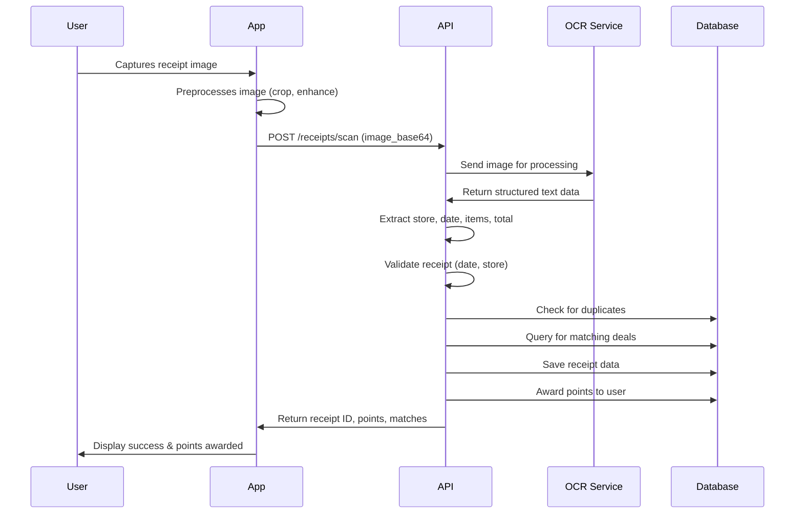
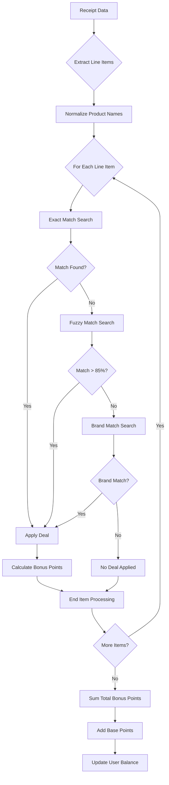
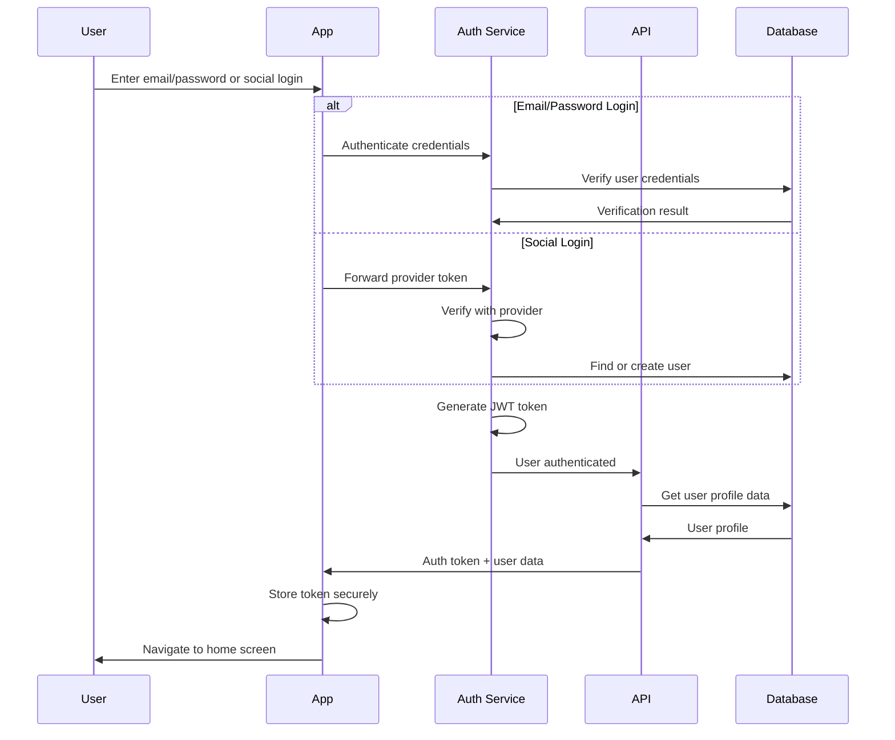
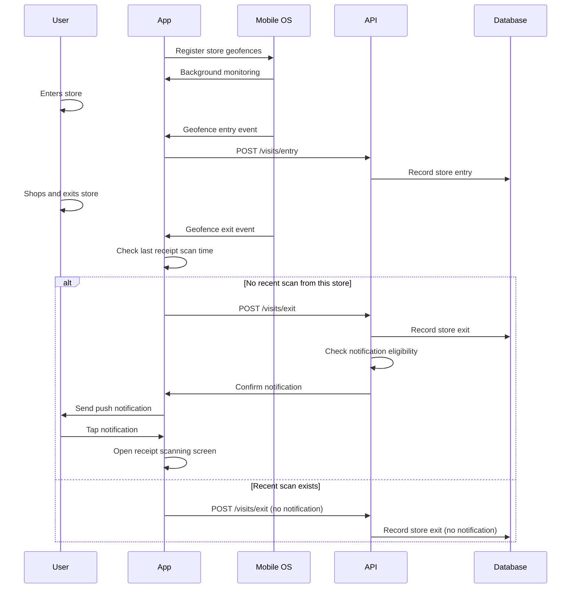
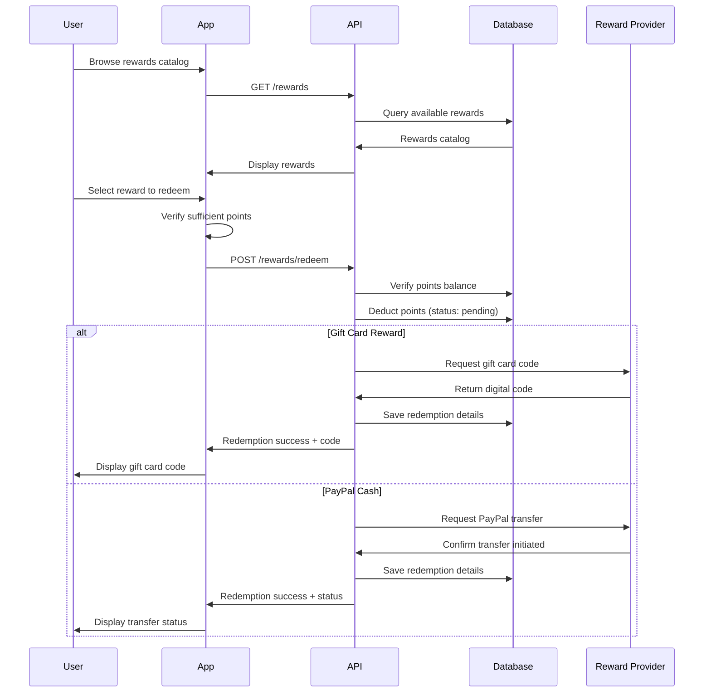
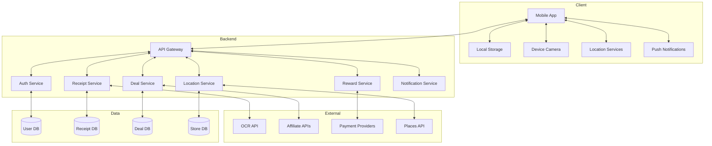
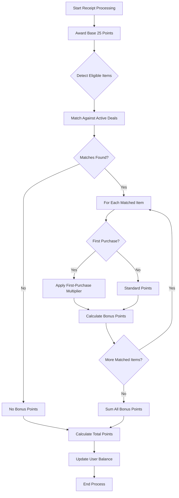

# Data Flow Diagrams

This document provides data flow diagrams for the key processes in the ReceiptSaver app. These diagrams help developers understand the sequence of operations and data transformations.

## 1. Receipt Scanning Process

## 2. Deal Matching Process

## 3. User Authentication Flow

## 4. Location-Based Notification Flow

## 5. Reward Redemption Flow

## 6. Data Architecture Overview

## 7. Points Calculation Logic

These diagrams provide detailed visual representations of the key data flows within the ReceiptSaver app and should help developers understand the system architecture and implementation requirements.
