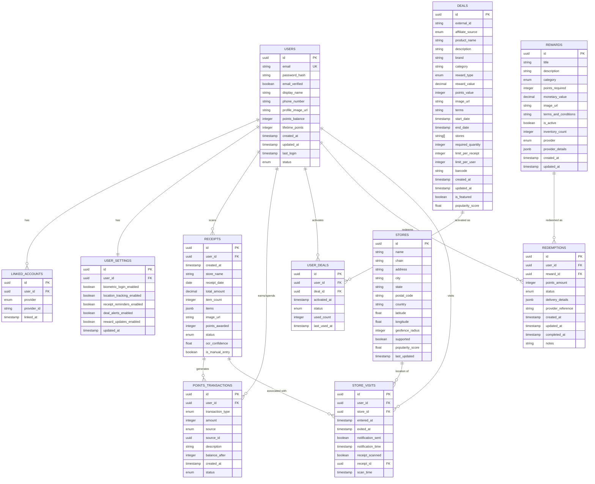

# Database Schema (Part 1)

This document outlines the complete database schema for the ReceiptSaver app, including all tables, relationships, and indexes. This schema is designed to support all the features described in the PRD while maintaining performance and scalability.

## Entity Relationship Diagram

